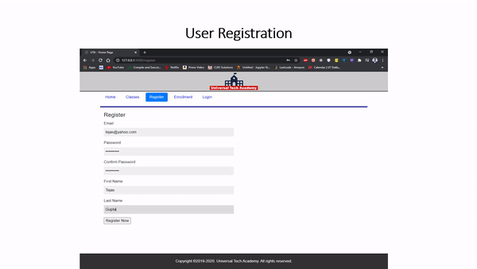

# Full Stack Web Application for Enrollment in Courses
• Built a dynamic web application using Python and Flask
• Set up the environment, worked with templates and configured the database using Flask-MongoEngine
• Worked with Web Forms, integrated security mechanisms using Flask-Security. Created and tested REST APIs using Postman

Skills: Flask, Python, MongoDB, Postman

